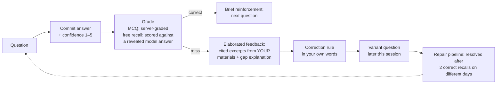

# Study-Bot

A studying platform built on the cognitive science of learning — retrieval practice, spaced repetition, and tight feedback loops. You upload your course materials; Study-Bot turns them into question decks, review schedules, and a week-by-week plan built backwards from your exam date.

## Why it works

Every mechanic traces to a specific finding in the learning-science literature — including the boundary conditions where a technique is deliberately *not* applied. The short version:

- **Retrieval beats rereading.** Practice testing outperforms restudying by ~50% at a week's delay, so every session is a question deck, never a page of notes (Roediger & Karpicke 2006).
- **Spacing is scheduled for you.** An SM-2 scheduler spaces each objective at ~10–20% of the time remaining before your exam, compressing to daily review in the final days — because inside ~24 hours, cramming genuinely wins (Cepeda et al. 2008).
- **Interleaving forces choice.** Mixed practice roughly doubled delayed test scores versus blocked practice; it feels harder, and that's the mechanism (Rohrer & Taylor 2007).
- **Feedback explains, immediately.** Elaborated feedback produces ~10x the effect of bare right/wrong marking, and in applied settings immediate beats delayed (Van der Kleij et al. 2015; Kulik & Kulik 1988).
- **Confident errors get hunted.** You rate confidence before seeing the answer; confident misses get the strongest correction and top repair priority — and stay open until two correct recalls on different days, because one correction doesn't stick (Butterfield & Metcalfe 2001; Rawson & Dunlosky 2011).
- **Novices start from worked examples.** Procedural topics open with a fully worked solution, then fade it step by step within the session to avoid the expertise-reversal trap (Sweller & Cooper 1985; Renkl 2002).

The full treatment — effect sizes, primary citations, and the failure modes each feature is designed around — is in **[docs/LEARNING_SCIENCE.md](docs/LEARNING_SCIENCE.md)**.

## Quick start

```bash
git clone <repo> && cd Study-Bot
npm install
npm run setup     # creates .env with generated secrets, starts Postgres via Docker, runs migrations
npm run dev       # → http://localhost:3000
```

That's it — the defaults need no API keys or external accounts: `AI_PROVIDER=mock` serves deterministic question templates, `EMAIL_PROVIDER=console` logs email to stdout, and `GOOGLE_PROVIDER=fake` stubs calendar sync. To get real AI-generated questions and feedback, set `AI_PROVIDER=openai` and `OPENAI_API_KEY` in `.env`.

Notes:

- `npm run setup` is idempotent — it never overwrites an existing `.env` or a secret you've set yourself.
- No Docker? Setup says so and keeps going: point `DATABASE_URL` in `.env` at your own PostgreSQL and run `npx prisma migrate deploy`.
- The Docker database (`pgvector/pgvector:pg16`) listens on host port **5433** to avoid clashing with a local Postgres on 5432. Manage it with `npm run db:up` / `db:down` / `db:logs`.
- Optional: `npm run worker` starts the background job worker (document embedding).
- Full-stack Docker alternative: `docker compose up` builds and runs app + db together (it reads `NEXTAUTH_SECRET` from `.env`, so run `npm run setup` first).

## Study modes

| Mode | What it does | Use it when |
|------|--------------|-------------|
| `RETRIEVAL` | Free-recall + MCQ deck generated from your materials, scored immediately with elaborated feedback. | The default — most sessions, most of the time. |
| `INTERLEAVED_PRACTICE` | The same loop with prompts round-robin mixed across objectives (never more than 2 in a row from one). | Topics are similar enough to confuse — telling them apart is the skill. |
| `EXAM_SIM` | Answer everything with zero feedback, then a mandatory review phase where you score each answer. | The final stretch — rehearse test conditions and self-monitoring. |
| `ERROR_REPAIR` | A deck built from your unresolved errors, confident misses first; each resolves only after 2 correct recalls on different days. | Your error queue is non-empty — i.e., after any honest session. |
| `WORKED_EXAMPLES` | Fully worked example → completion problems with the last step, then last two, missing → full transfer problem. | First exposure to procedural or quantitative material. |

Every mode shares the same spine: pretest diagnostics for never-studied objectives (quarantined from grading), warm-ups for objectives due for review, timed work/break cycles, variant questions injected after misses, and full resumability — a refresh or crash loses nothing.

## The feedback loop

The core interaction, on every question:



Nothing is revealed before you commit — no hints, excerpts, or answers (enforced server-side, covered by an E2E test). Misses get cited excerpts from your own uploaded materials, an explanation of your specific gap, per-distractor rationales for MCQ, and optional self-explanation prompts. Confident misses get the most emphatic correction and the fastest resurfacing. The whole loop runs keyboard-first: answer, submit, rate, and advance without touching the mouse.

## Feature map

- **Content upload + search** — PDFs and notes, chunked and searched with Postgres full-text search (optional embedding-based hybrid search behind `HYBRID_SEARCH_ENABLED`). Every generated question and feedback cites its exact source chunks.
- **Flashcards** — decks you create, plus cards auto-generated from your errors; SM-2 scheduled with the same exam-aware compression.
- **Study planner** — `/plan` schedules sessions backwards from your exam date around your availability, with Google Calendar sync and ICS/webcal export.
- **Gamification** — XP, achievements, and streaks, awarded only at session boundaries so they never intrude on the answer loop.
- **Calibration dashboard** — your confidence vs. your accuracy, per session and over time.

## Configuration

`npm run setup` produces a working `.env`. The variables that matter most:

| Variable | One line |
|----------|----------|
| `DATABASE_URL` | Postgres connection string; the default targets the Docker db on port 5433. |
| `NEXTAUTH_SECRET` | Session signing key — generated by setup. |
| `AI_PROVIDER` | `mock` (default, fully offline) or `openai`. |
| `OPENAI_API_KEY` | Required when `AI_PROVIDER=openai`. |
| `AI_MODEL_ANSWER` | Generation model (default `gpt-4o-mini`). |
| `AI_DAILY_COST_CAP_USD` / `AI_MONTHLY_COST_CAP_USD` | Per-user spend caps (defaults $1 / $10); `AI_DISABLED=true` is the kill switch. |
| `TOKEN_ENC_KEY` | 32-byte key for AES-256-GCM encryption of Google OAuth tokens — generated by setup, required in production. |
| `GOOGLE_CLIENT_ID` / `GOOGLE_CLIENT_SECRET` / `GOOGLE_PROVIDER` | Calendar OAuth; `GOOGLE_PROVIDER=fake` (default) stubs sync, `real` for production. |
| `EMAIL_PROVIDER` | `console` (default, logs to stdout) or `smtp`. |
| `LOG_LEVEL` | `debug` \| `info` \| `warn` \| `error`. |

The rest are documented inline in [.env.example](.env.example).

> **Warning:** `ALLOW_TEST_AUTH` makes the app trust the `X-User-Id` header as the authenticated identity. It exists only for automated tests and must never be set in production.

## Development

| Command | What it does |
|---------|--------------|
| `npm run dev` / `build` / `start` | Next.js dev server / production build / serve. |
| `npm test` | All Vitest tests. |
| `npm run test:unit` | Unit tests — no database needed. |
| `npm run test:integration` | Integration tests — needs Postgres. |
| `npm run test:e2e` | Playwright E2E — needs Postgres, plus `npx playwright install --with-deps chromium` once. |
| `npm run worker` | Background job worker (embedding batches; polls `job_queue` with `SKIP LOCKED`). |
| `npm run db:up` / `db:down` / `db:logs` | Start / stop / tail the Docker Postgres. |
| `npm run db:migrate` / `db:push` / `db:generate` | Prisma migrations / schema push / client generation. |
| `npm run db:seed-research` | Seed the Study Science KB with the research library. |
| `npm run lint` | ESLint. |

Integration and E2E tests read `DATABASE_URL` — point it at a dedicated test database rather than your dev one (CI uses `studybot_test` and `studybot_e2e`).

Project layout:

```
src/app/        Routes: home, /plan, /s/:sessionId (session runner), /flashcards,
                /guides, /learn, /settings, /api/*
src/services/   Domain logic: run, feedback, plan, content, publish,
                spaced-repetition, flashcards, ...
src/lib/        Prompts, SM-2 mastery, spacing, validation, ai/ (gateway +
                prompt registry), jobs, calendar
prisma/         Schema + migrations
e2e/            Playwright specs
docs/           LEARNING_SCIENCE.md — the research foundation
```

## Architecture notes

- **Next.js 14 (App Router) + TypeScript**, with Zod validation at every API boundary.
- **Prisma on PostgreSQL.** The bundled image is `pgvector/pgvector:pg16` — plain Postgres 16 plus the pgvector extension, used by the optional hybrid-search path.
- **Background jobs** run through a Postgres-backed `job_queue` polled with `SKIP LOCKED` by `npm run worker` — no Redis or external broker.
- **AI gateway** — one choke point for all model calls, with response caching, per-user daily/monthly cost caps, request timeouts, a circuit breaker, and an emergency kill switch. Providers are pluggable (`openai`, `mock`).
- **Mock providers everywhere** (AI, Google Calendar, email) keep the entire app runnable offline and in CI, with no credentials.
