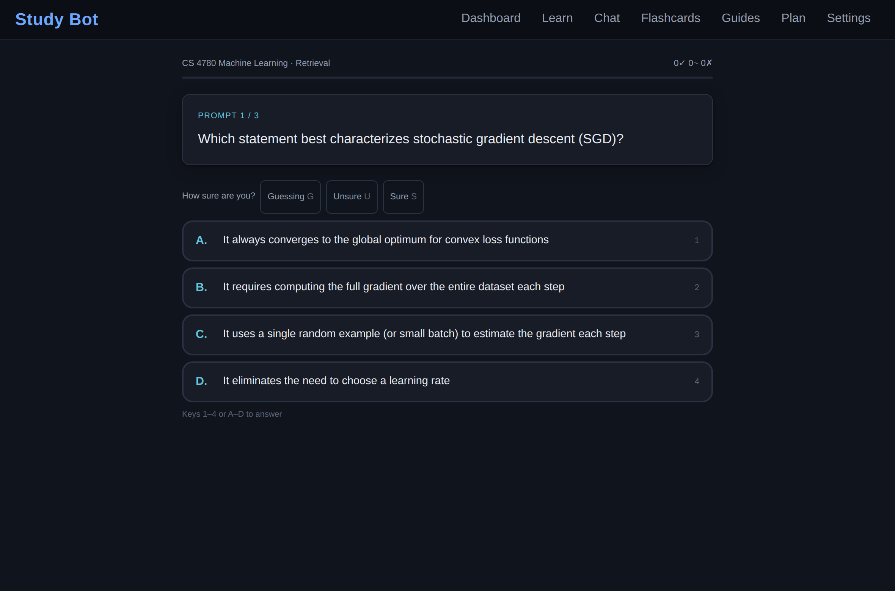
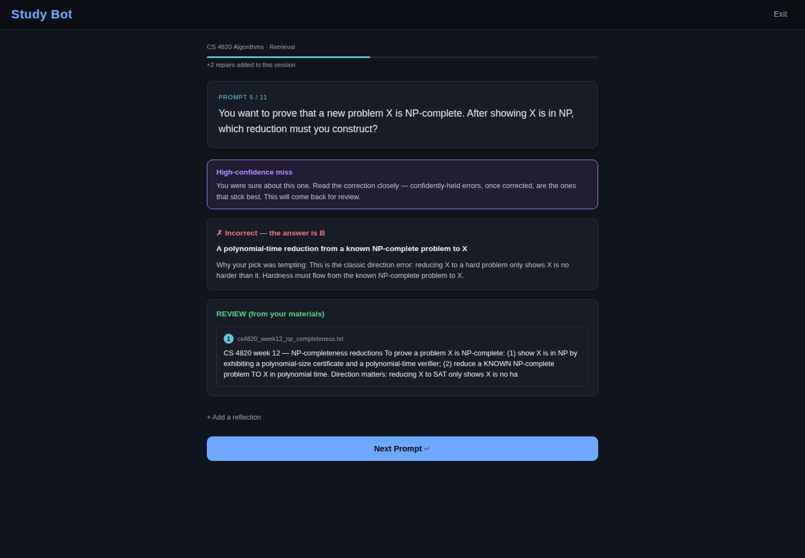
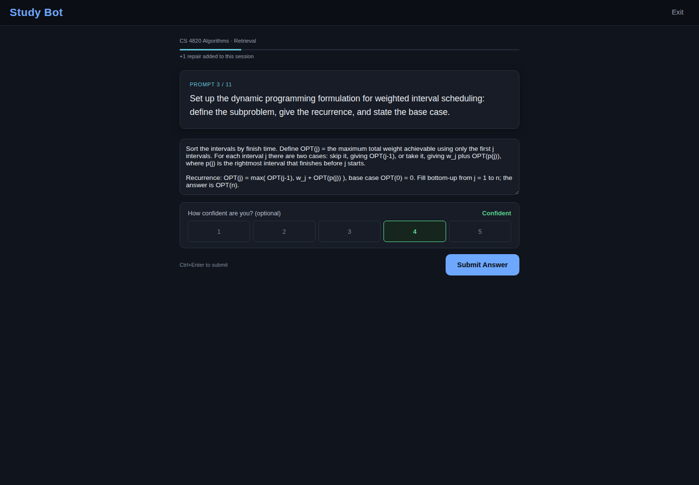
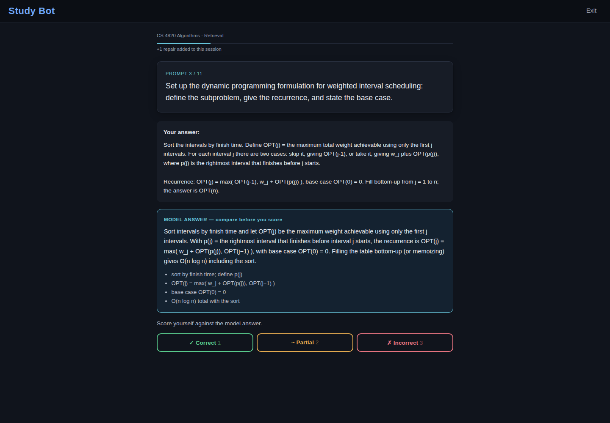
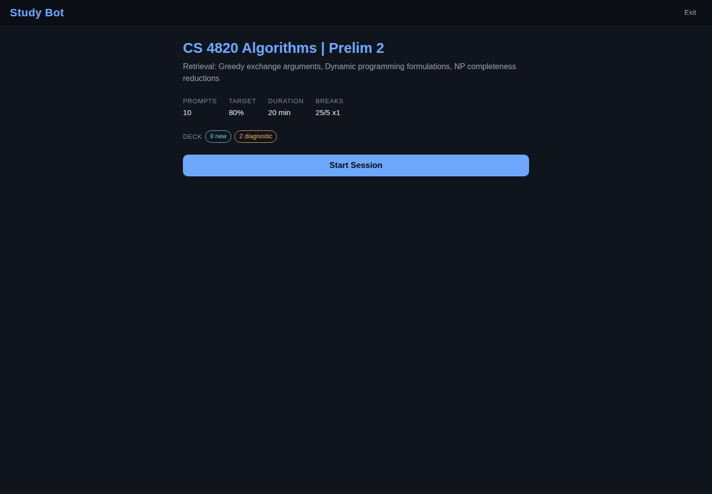
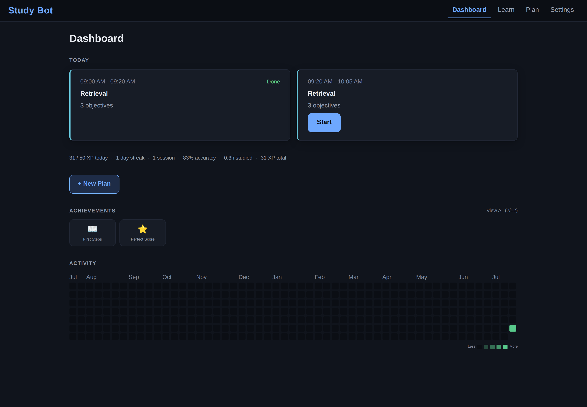

# Study Bot

A studying platform built on the cognitive science of learning. Upload your course materials, and it turns them into retrieval practice with instant graded feedback, spaced review scheduled around your exam date, and error repair that follows you until a mistake is genuinely fixed.

<p align="center">
  
</p>

<p align="center"><em>The core loop: rate your confidence, answer, and get graded feedback with the reasoning behind the trap you picked. All in seconds.</em></p>

## Why it works

Every mechanic traces to a specific finding in the learning science literature, including the boundary conditions where a technique is deliberately not applied. The five minute version:

* **Testing beats rereading.** Practice testing outperforms restudying by about half again at a week of delay, so every session is a question deck, never a page of notes. Roediger and Karpicke (2006); meta analysis by Adesope and colleagues (2017); rated a top technique by Dunlosky and colleagues (2013).
* **Feedback speed and quality are the engine.** The active ingredient of deliberate practice is a tight loop: attempt, immediate informative feedback, corrected attempt. Ericsson and colleagues (1993). Immediate feedback is the right default in applied settings per Kulik and Kulik (1988), and elaborated explanation produces roughly ten times the effect of a bare right or wrong mark per Van der Kleij and colleagues (2015).
* **Your most fixable errors are the confident ones.** Errors made with high confidence, once corrected emphatically, are remembered best. Butterfield and Metcalfe (2001). They also resurface after a delay, so they get their own intensified review schedule. Butler, Fazio, and Marsh (2011).
* **One correct answer is not mastery.** Durable learning requires successive relearning: correct retrievals spaced across separate days. Rawson and Dunlosky (2011).
* **Mixed practice feels worse and works better.** Interleaving related topics roughly doubled delayed test scores versus blocked practice in mathematics. It feels harder, and that difficulty is the mechanism. Rohrer and Taylor (2007); classroom trial by Rohrer and colleagues (2020).
* **Struggling before studying helps.** Attempting questions on material you have not studied yet primes later encoding, even when you answer wrong. Richland, Kornell, and Kao (2009).
* **Spacing is scheduled for you.** An SM2 scheduler spaces each objective and compresses intervals as the exam approaches, following the optimal retention ridgeline of Cepeda and colleagues (2008).

The full treatment, with effect sizes, primary citations, and the failure modes each feature is designed around, lives in [docs/LEARNING_SCIENCE.md](docs/LEARNING_SCIENCE.md).

## Quick start

Prerequisites: Node 20.19 or newer, plus Docker Desktop (or your own PostgreSQL server).

```
git clone <repo> && cd Study-Bot
npm install
npm run setup
npm run dev
```

Then open http://localhost:3000. The defaults need no API keys or external accounts: the AI provider is a deterministic mock, email logs to the console, and calendar sync uses a local fake.

To be blunt about the default: mock mode exists for tests. With `AI_PROVIDER` set to `mock`, sessions get template questions and canned feedback, which exercises the machinery but teaches you nothing. To actually study, set `AI_PROVIDER` to `openai` and add an `OPENAI_API_KEY` in `.env`.

What `npm run setup` does: copies `.env.example` to `.env`, generates `NEXTAUTH_SECRET` and `TOKEN_ENC_KEY`, starts PostgreSQL through Docker, and applies all migrations. It is idempotent and never overwrites a value you set yourself.

Notes:

* No Docker? Setup says so and keeps going. Point `DATABASE_URL` in `.env` at your own PostgreSQL and run `npx prisma migrate deploy`.
* The Docker database listens on host port 5433 to avoid clashing with a local PostgreSQL on 5432. Manage it with `npm run db:up`, `npm run db:down`, and `npm run db:logs`.
* Optional: `npm run worker` starts the background job worker for document embedding.
* Full stack alternative: `docker compose up` builds and runs the app and database together. It reads `NEXTAUTH_SECRET` from `.env`, so run `npm run setup` first.

## What it looks like

Multiple choice questions are graded by the server, and the answer key never reaches your browser before you commit. Rate your confidence first with one tap or one key.

<p align="center">
  
</p>

Miss a question you were sure about, and the app names the moment. That is the hypercorrection effect, and the review that follows is engineered around it. Notice the next question already loaded above the feedback: zero dead time between attempts.

<p align="center">
  
</p>

Free recall questions make you answer from memory before anything is revealed, with confidence collected while you still cannot see the answer.

<p align="center">
  
</p>

Then you score yourself against an explicit model answer and key points, not a feeling. Accurate self assessment requires a reference standard.

<p align="center">
  
</p>

Every session opens with a preflight card stating the contract: mode, scope, prompt count, and break protocol.

<p align="center">
  
</p>

The dashboard tracks your daily XP goal, streak, accuracy, achievements, and a year of activity, and it stays out of your way while you study.

<p align="center">
  
</p>

## Study modes

* **Retrieval** is the default: free recall plus multiple choice generated from your materials, scored immediately with elaborated feedback.
* **Interleaved practice** runs the same loop with prompts mixed across objectives, never more than two in a row from one topic. Use it when topics are similar enough to confuse, because telling them apart is the skill.
* **Exam simulation** withholds all feedback until the end, then walks you through scoring your locked answers. This is the one place delayed feedback is intentional.
* **Error repair** builds a deck from your unresolved mistakes, confident misses first. Each error resolves only after two correct recalls on different days.
* **Worked examples** teach procedural material by fading: study a fully worked solution with the reasoning behind each step, then solve versions with the final step missing, then the final two, then a full transfer problem.

Every mode shares the same spine: pretest diagnostics for never studied objectives (quarantined from grading), warm ups for objectives due for review, timed work and break cycles, variant questions injected after misses, and full resumability. A refresh or crash loses nothing.

## The feedback loop

1. You commit an answer, and optionally a confidence rating, before anything is revealed. No hints, excerpts, or answers leak beforehand; this is enforced server side and covered by an end to end test. Committed retrieval attempts enhance learning even when they fail, per Kornell, Hays, and Bjork (2009).
2. Multiple choice answers are graded server side instantly, including why the distractor you picked was tempting. Free recall answers are compared against a revealed model answer with key points.
3. Elaborated feedback cites exact excerpts from your own uploaded materials, and generation starts the moment your attempt lands so the wait is minimal. It persists with the attempt and never regenerates or disappears.
4. A miss creates an error log and injects a retry variant later in the same session. The error resolves only after two correct retrievals on different days, and a wrong retry resets the streak.
5. The whole loop runs from the keyboard: number keys answer and score, Enter advances. More feedback cycles per hour is the entire point.

## Techniques and the research behind them

Each technique below is implemented in the product. Citations are shortened here; the full bibliography with paper titles and effect sizes is in [docs/LEARNING_SCIENCE.md](docs/LEARNING_SCIENCE.md).

* **Retrieval practice.** All five modes are built on active recall of your materials. Roediger and Karpicke (2006); Adesope and colleagues (2017); Dunlosky and colleagues (2013).
* **Deliberate practice loops.** Immediate informative feedback on every attempt, with difficulty adapting toward a band slightly above your current level. Ericsson and colleagues (1993); Kulik and Kulik (1988); Corbett and Anderson (2001); Bjork and Bjork on desirable difficulties.
* **Elaborated, task focused feedback.** Misses always get the correct answer plus an explanation grounded in your own course materials, never a bare mark, and the framing targets the task rather than the person. Van der Kleij and colleagues (2015); Shute (2008); Kluger and DeNisi (1996).
* **Hypercorrection.** Confidence is captured before the answer is revealed; confident misses get flagged, receive the fullest correction, and jump the queue in error repair decks. Butterfield and Metcalfe (2001); Butler, Fazio, and Marsh (2011); Fazio and Marsh (2009).
* **Spaced repetition with exam awareness.** Objective mastery and flashcards both run on an SM2 scheduler whose intervals compress as the exam approaches, and inside the final day the app deliberately lets you cram. Cepeda and colleagues (2006, 2008).
* **Successive relearning.** Error logs resolve only after two correct retrievals on different calendar days, and follow up session dates come from the actual scheduler rather than a fixed table. Rawson and Dunlosky (2011); Rawson, Dunlosky, and Sciartelli (2013).
* **Interleaving.** Mixed practice decks alternate objectives, and AI generated decks are reinterleaved so they never collapse into blocked practice. Rohrer and Taylor (2007); Rohrer and colleagues (2020); Kornell and Bjork (2008); boundary conditions from Brunmair and Richter (2019).
* **Pretesting.** New objectives get a diagnostic question before study. Wrong answers there are expected, framed supportively, and quarantined from your grades and error logs. Richland, Kornell, and Kao (2009); Pan and Sana (2021).
* **Worked examples with backward fading.** Study a stepped solution, then complete progressively less scaffolded problems, because novices learn more from studying solutions than from unassisted problem solving, while experts should skip ahead. Sweller and Cooper (1985); Renkl and colleagues (2002); Kalyuga and colleagues (2003).
* **Multiple choice done safely.** Answer keys are withheld from the client until you answer, correct answer confirmation always closes the loop to prevent lure learning, and distractors are built from documented misconceptions. Roediger and Marsh (2005); Butler and Roediger (2008).
* **Self explanation and generation.** After feedback you can restate the concept in your own words, invent your own example, and answer a Socratic follow up, all saved with the attempt. Chi and colleagues (1989); Bisra and colleagues (2018).
* **Calibration.** Your confidence ratings are charted against your actual outcomes, because overconfidence produces underachievement. Dunlosky and Rawson (2012); Nelson and Dunlosky (1991).
* **A cognitive load minimal interface.** One question at a time, the question is the largest thing on screen, status chrome sits in low contrast, and decoration is omitted. Sweller (1988); Sundararajan and Adesope (2020) on seductive details.

## Feature map

* **Content upload and search.** PDFs and notes are chunked and searched with PostgreSQL full text search, and every generated question and piece of feedback cites its exact source chunks. Optional embedding based hybrid search sits behind `HYBRID_SEARCH_ENABLED`.
* **Flashcards.** Decks you create, plus cards auto generated from your errors with the correction as the answer, scheduled by the same exam aware SM2.
* **Study planner.** Sessions scheduled backwards from your exam date around your availability, with pre exam tapering, Google Calendar sync, and ICS export.
* **Progress.** XP, achievements, streaks, per objective mastery, and a calibration dashboard. Gamification is awarded only at session boundaries so it never intrudes on the answer loop.

## Configuration

`npm run setup` produces a working `.env`, and `.env.example` documents every variable inline. The ones that matter most:

* `DATABASE_URL` is the PostgreSQL connection string. The default targets the Docker database on port 5433.
* `NEXTAUTH_SECRET` signs sessions. Generated by setup.
* `AI_PROVIDER` is `mock` by default (fully offline) or `openai`, which requires `OPENAI_API_KEY`.
* `AI_MODEL_ANSWER` picks the generation model and `AI_MODEL_EMBED` the embedding model.
* `AI_DAILY_COST_CAP_USD` and `AI_MONTHLY_COST_CAP_USD` are hard per user spending caps, and `AI_DISABLED` set to true is the emergency kill switch.
* `TOKEN_ENC_KEY` encrypts stored Google OAuth tokens. Generated by setup and required in production.
* `GOOGLE_CLIENT_ID`, `GOOGLE_CLIENT_SECRET`, and `GOOGLE_PROVIDER` control calendar sync. The default `fake` provider stubs it; use `real` in production.
* `EMAIL_PROVIDER` is `console` by default, or `smtp` with the SMTP variables for real mail.
* `LOG_LEVEL` accepts debug, info, warn, or error.

One warning: `ALLOW_TEST_AUTH` makes the app trust a header as the authenticated identity. It exists only for automated tests and must never be set in production.

## Deployment and ops notes

* **Auth gates.** `REQUIRE_EMAIL_VERIFICATION` is off by default, so new accounts can sign in immediately; enable it only once real SMTP is configured, because the console email provider prints verification links to server logs only. `ALLOW_TEST_AUTH` must never be set in production. `TOKEN_ENC_KEY` is required in production (setup generates one for local use).
* **One long lived Node process.** The app is not serverless safe. Feedback is generated eagerly when an attempt lands, and the AI rate limiter and circuit breaker hold their state in process, so run it as a single persistent Node server via `npm start` rather than as per request functions.
* **The port 3000 trap.** If something else already holds port 3000, Next silently starts on 3001 while `NEXTAUTH_URL` still points at 3000, and sign in breaks with baffling redirects. Free port 3000, or update `NEXTAUTH_URL` (plus `BASE_URL` and `NEXT_PUBLIC_APP_URL`) to the port actually in use.
* **Admin routes.** The `/admin` pages and admin APIs are gated by `ADMIN_USER_IDS`, a comma separated list of user UUIDs. Until you set it, nobody is an admin.

## Development

* `npm run dev`, `npm run build`, and `npm start` cover the dev server and production.
* `npm test` runs everything vitest knows. `npm run test:unit` needs no database.
* `npm run test:integration` needs PostgreSQL reachable through `DATABASE_URL`.
* `npm run test:e2e` runs Playwright against a production build, also database backed. Run `npx playwright install chromium` once first.
* `npm run worker` processes background jobs, and `npm run db:migrate` creates new migrations.

Integration and e2e tests read `DATABASE_URL`; point it at a dedicated test database rather than your dev one.

Layout, briefly: `src/app` holds pages and API routes, `src/services` holds domain logic, `src/lib` holds the science (prompt generation, spacing, mastery) and infrastructure (AI gateway, jobs, search), `prisma` holds schema and migrations, `e2e` holds Playwright specs, and `docs` holds the learning science foundation.

## Architecture notes

* Next.js App Router with TypeScript and zod validation at every API boundary.
* PostgreSQL through Prisma. The bundled image ships pgvector, so hybrid search can turn on without repaving the database.
* Background jobs run through a PostgreSQL backed queue with row locking. No Redis or external broker to operate.
* One AI gateway is the choke point for all model calls, with response caching, per user cost caps, request timeouts, a circuit breaker, and an emergency kill switch. Providers are pluggable, and the mock provider keeps the whole app usable offline and in CI.
* Feedback is generated eagerly at submit time, claimed atomically so concurrent requests never double spend, and persisted with the attempt.

## References

The complete bibliography with paper titles, journals, and the mapping from each finding to a feature: [docs/LEARNING_SCIENCE.md](docs/LEARNING_SCIENCE.md). Works cited in this README: Adesope, Trevisan, and Sundararajan (2017); Bisra and colleagues (2018); Bjork and Bjork (1992, 2011); Brunmair and Richter (2019); Butler, Fazio, and Marsh (2011); Butler and Roediger (2008); Butterfield and Metcalfe (2001); Cepeda and colleagues (2006, 2008); Chi and colleagues (1989); Corbett and Anderson (2001); Dunlosky and Rawson (2012); Dunlosky and colleagues (2013); Ericsson and colleagues (1993); Fazio and Marsh (2009); Kalyuga and colleagues (2003); Kluger and DeNisi (1996); Kornell and Bjork (2008); Kornell, Hays, and Bjork (2009); Kulik and Kulik (1988); Metcalfe, Kornell, and Finn (2009); Nelson and Dunlosky (1991); Pan and Sana (2021); Rawson and Dunlosky (2011); Rawson, Dunlosky, and Sciartelli (2013); Renkl and colleagues (2002); Richland, Kornell, and Kao (2009); Roediger and Karpicke (2006); Roediger and Marsh (2005); Rohrer and Taylor (2007); Rohrer and colleagues (2020); Shute (2008); Sundararajan and Adesope (2020); Sweller (1988); Sweller and Cooper (1985); Van der Kleij and colleagues (2015).
